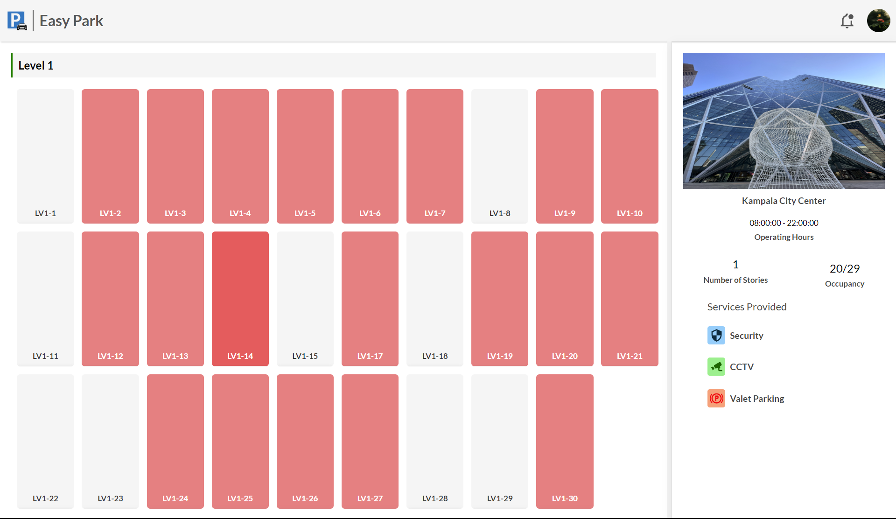
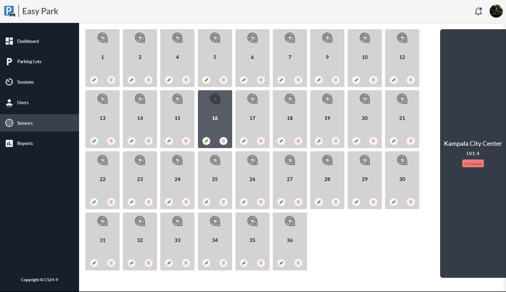
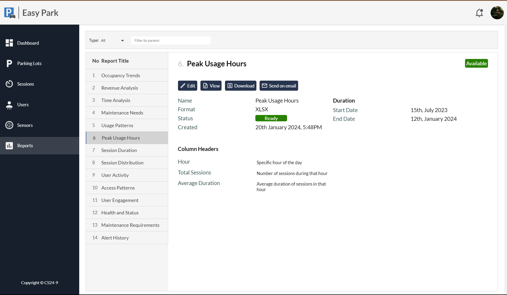

# Easy Park

This is the administrator interface for a smart parking system. Designed using React. It depends on a server API for proper functionality. check out the server here. [smartParkingAPI](https://github.com/edgarmuyomba/smartParkingAPI). The complete system was designed in part for completion of a requirement for my computer science final year project.

## Features
- Realtime statistics regarding the system fetched from a server
- Ability and provision to perform all **CRUD** operations 
- Ability to generate and download reports

## Screenshots
The Dashboard


Parking Lot Detail Page


Registered Sensors


Reports Page


## Setting up dev
> [!CAUTION]
> Make sure you have setup the [smartParkingAPI](https://github.com/edgarmuyomba/smartParkingAPI) server and its running!

- Clone the repository
  ```bash
  git clone <url>
  ```
- Navigate to the created directory `easypark`
  ```bash
  cd easypark
  ```
- Install the required dependencies
  ```bash
  npm install
  ```
- Run the server
  ```bash
  npm run dev
  ```
You can access the demo project on [localhost:5173](http://localhost:5173)

## Packages used
- [React](https://react.dev/)
- [Vite](https://vitejs.dev/guide/)
- [ReCharts](https://recharts.org/)
- [FileSaver](https://www.npmjs.com/package/file-saver)
- [React-Router](https://reactrouter.com/)